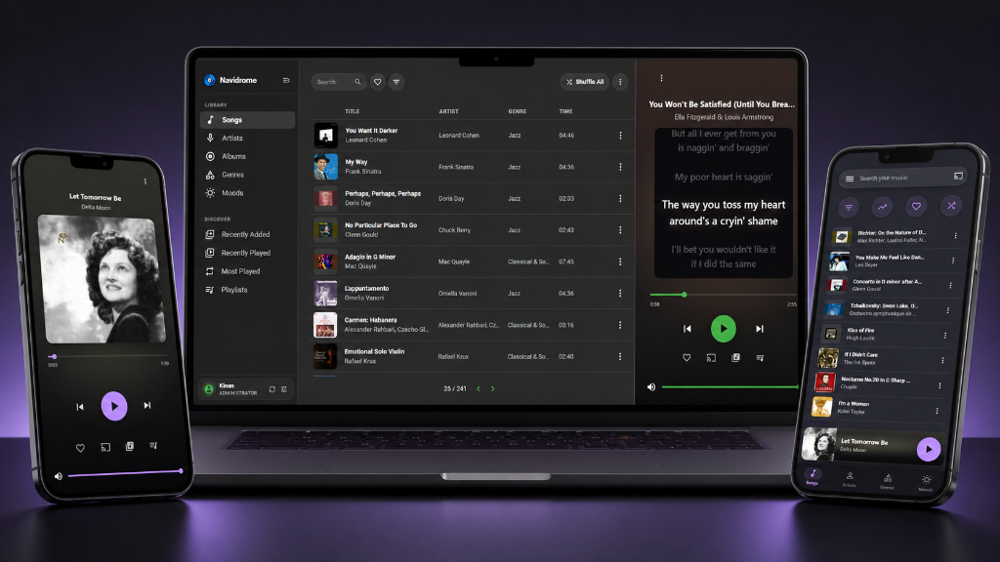

# Bragi

[](https://github.com/Kinanqaz/Bragi/actions/workflows/custom-image.yml)



**Bragi** is a modern, mobile-first music streaming server and Progressive Web App (PWA). Designed with sleek glassmorphism, responsive touch navigation, synchronized lyrics, and direct Google Cast support, Bragi turns your personal music collection into a premium streaming experience.

---

## 🌟 Top 10 Features in Bragi

### 1. 📡 Google Cast (Chromecast) Integration
- Cast music directly to Chromecast, Google Home/Nest speakers, and Android TVs from the web UI and PWA.
- Full remote playback synchronization, volume adjustment, seeking, and live Cast connection diagnostics.

### 2. 🎵 Modern Responsive Player Surface
- Redesigned player surface for both desktop and mobile (`ModernPlayerSurface` / `MobilePlayerSurface`).
- Dynamic ambient artwork backdrop coloring (`artworkColor`) that adapts to the currently playing song's album art.
- Expanded queue drawer with easy reordering, swipe interactions, and queue management.

### 3. 📱 Full PWA & Dynamic Notch/Theme Synchronization
- Standalone Progressive Web App with optimized service worker caching and manifest shortcuts.
- Dynamic `<meta name="theme-color">` runtime synchronization (`useChangeThemeColor`) that adapts the mobile notch and status bar to current theme and player states.
- Safe-area inset support designed specifically for modern notched mobile displays.

### 4. 📲 Mobile Bottom Navigation & Touch Gestures
- Dedicated mobile navigation bar (`MobileBottomNav`) for one-tap switching between Songs, Albums, Artists, Playlists, and Search.
- Mobile touch gestures, including pull-down to minimize player and quick-action sheets.

### 5. ✨ Modern Song & Album Discovery Experience
- Brand new `ModernSongList` with faceted filtering, fast multi-field searching, customizable items-per-page, and album art thumbnails.
- Flexible responsive layout switching between dense list, card view, and facet grids.

### 6. 🎤 Synchronized Lyrics Canvas
- Dedicated lyrics canvas interface with synchronized line-by-line scrolling and distraction-free full-screen display.

### 7. 🎧 Native OS Media Session API Integration
- Complete integration with the browser's Media Session API for rich lock screen controls, notification center metadata, album artwork, and Bluetooth/headset media key controls.

### 8. ⚡ Robust Modular Playback Engine
- Decoupled `PlaybackEngine` architecture separating playback state from HTML5 audio and Cast streams.
- Smooth debounced volume controls, gapless queue progression, and reliable track transition policies.

### 9. 🎨 Curated Glassmorphism & Modern Themes
- Beautiful glassmorphic themes (such as `SquiddiesGlass`, `amusic`, and updated `gruvboxDark`) featuring modern typography, refined dark palettes, and subtle micro-animations.

### 10. 🗑️ Permanent Media File Deletion (Admin Safeguard)
- Administrators can permanently delete individual songs directly from the web context menu (`ND_ENABLEMEDIAFILEDELETION="true"`).
- Protected by strict server-side safeguards: administrator-only checks, path traversal/symlink escape prevention, and automated cleanup of related database records.

---

## 🚀 Quick Start with Docker Compose

Pushes to `master` automatically build and publish the container image to GitHub Container Registry:

```yaml
services:
  bragi:
    image: ghcr.io/kinanqaz/bragi:latest
    container_name: bragi
    environment:
      ND_ENABLEMEDIAFILEDELETION: "true" # Optional: enable admin file deletion
    volumes:
      - /path/to/data:/data
      - /path/to/music:/music:rw
    ports:
      - "4533:4533"
    restart: unless-stopped
```

---

## 🛠️ Development & Local Testing

Bragi is built with Go, React, SQLite, and Vite.

To run the live single-origin development environment locally:

```powershell
.\scripts\dev.ps1
```

- Starts Vite on `http://localhost:4533` with hot-module reloading (HMR).
- Runs the backend API on `http://localhost:4633`.
- Serves test music fixtures from `tests/fixtures/test_songs files`.

---

## 📜 Acknowledgements & License

- **Acknowledgements**: Bragi was originally created based on the wonderful [Navidrome](https://github.com/navidrome/navidrome) project by Deluan and contributors.
- **License**: Licensed under the [GNU General Public License v3](LICENSE).
